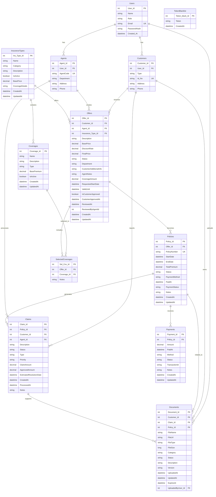

# Insurance Management System - Database Schema (Mermaid)

## 🗄️ Entity Relationship Diagram

## 📊 Database Tables Summary

### 🔐 **Core Tables**
- **Users** - Kullanıcı yönetimi (Admin, Agent, Customer)
- **Customers** - Müşteri bilgileri
- **Agents** - Acenta bilgileri

### 🏦 **Insurance Tables**
- **InsuranceTypes** - Sigorta türleri (Sağlık, Kasko, Deprem)
- **Coverages** - Teminat detayları
- **SelectedCoverages** - Seçilen teminatlar

### 💼 **Business Tables**
- **Offers** - Sigorta teklifleri
- **Policies** - Sigorta poliçeleri
- **Claims** - Hasar talepleri
- **Payments** - Ödeme kayıtları

### 📁 **File Management**
- **Documents** - Dosya yönetimi

## 🔗 **Key Relationships**

1. **User → Customer/Agent** (1:1) - Bir kullanıcı ya müşteri ya da acentadır
2. **Customer → Offers** (1:N) - Müşteri birden fazla teklif alabilir
3. **Agent → Offers** (1:N) - Acenta birden fazla teklif oluşturabilir
4. **Offer → Policy** (1:1) - Teklif onaylandığında poliçe olur
5. **Policy → Claims** (1:N) - Poliçeden birden fazla hasar talebi olabilir
6. **Policy → Payments** (1:N) - Poliçe için birden fazla ödeme olabilir
7. **InsuranceType → Coverages** (1:N) - Sigorta türü birden fazla teminat içerebilir

## 🎯 **Database Features**

- **Referential Integrity** - Foreign key constraints
- **Audit Trail** - CreatedAt, UpdatedAt fields
- **Soft Delete** - Status fields for active/inactive records
- **Flexible File Storage** - Documents linked to multiple entities
- **Role-Based Access** - User roles determine access levels

## 📝 **Mermaid Format Notes**

Bu diagram Mermaid ER diagram formatında yazılmıştır ve şu özelliklere sahiptir:

- **PK** = Primary Key
- **FK** = Foreign Key  
- **UK** = Unique Key
- **||--o{** = One-to-Many relationship
- **||--||** = One-to-One relationship
- **}o--o{** = Many-to-Many relationship

### 🚀 **Kullanım**

Bu diagram'ı şu platformlarda görselleştirebilirsin:
- **GitHub** - README.md dosyalarında otomatik render
- **GitLab** - Markdown dosyalarında otomatik render
- **Mermaid Live Editor** - https://mermaid.live
- **VS Code** - Mermaid extension ile
- **Notion** - Mermaid desteği ile
