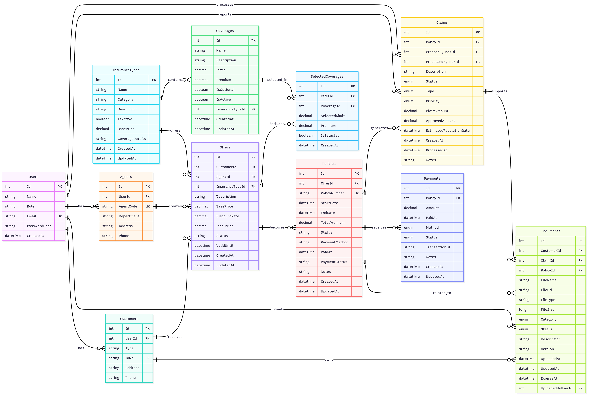

# Insurance Management System

A comprehensive insurance management platform built with modern technologies.

## Technology Stack

- **Frontend**: React with TypeScript
- **Backend**: .NET Core Web API
- **Database**: SQL Server (MSSQL)
- **Authentication**: JWT (JSON Web Tokens)
- **Password Hashing**: BCrypt

## Features

- ✅ **User Management and Authorization** (Completed)
- ✅ **Customer Management** (Completed)
- ✅ **Policy Management** (Completed)
- ✅ **Claims Management** (Completed)
- ✅ **Payment Processing** (Completed)
- ✅ **Document Management** (Completed)
- ✅ **Insurance Types Management** (Completed)
- ✅ **Offer Management** (Completed)
- ✅ **Agent Management** (Completed)
- ✅ **File Upload System** (Completed)
- ✅ **Reporting System** (Completed)

## 📊 Reporting System

### Available Reports
- **Sales Reports**: Revenue analysis, agent performance, monthly trends
- **Claims Reports**: Claims analysis, status distribution, cost analysis
- **Customer Reports**: Customer segmentation, retention analysis, regional distribution
- **Payment Reports**: Payment method analysis, monthly payment trends

### Report Features
- **Date Filtering**: Custom date range selection
- **Data Export**: Excel and PDF export capabilities
- **Dashboard Summary**: Key metrics and KPIs
- **Chart Data**: Visual representation of data trends
- **Quick Reports**: Pre-defined report templates

### Chart Types
- **Sales Charts**: Monthly revenue, agent performance, insurance type distribution
- **Claims Charts**: Monthly claims, status distribution, cost trends
- **Customer Charts**: Regional distribution, type segmentation, growth trends

## 🚀 Getting Started

### 📋 Prerequisites

- .NET Core 8.0 SDK
- SQL Server
- Node.js (for frontend)

### 🔍 Quick Overview

1. **Database Schema**: `Insurance_Mermaid_Chart.png` dosyasında görsel veritabanı şeması
2. **API Documentation**: Tüm endpoint'ler bu README'de listelenmiştir
3. **Testing**: Postman collection ve environment dosyaları hazır
4. **Authentication**: JWT token sistemi aktif

### Backend Setup

1. Navigate to the backend directory:
   ```bash
   cd backend/InsuranceAPI
   ```

2. Update the connection string in `appsettings.json`:
   ```json
   "ConnectionStrings": {
     "DefaultConnection": "Server=DESKTOP-TD03B1K\\SQLEXPRESS;Database=InsuranceSystem;Trusted_Connection=true;TrustServerCertificate=true;MultipleActiveResultSets=true"
   }
   ```

3. Run the database creation script:
   ```sql
   -- Execute the script in backend/InsuranceAPI/Database/CreateDatabase.sql
   ```

4. Start the backend:
   ```bash
   dotnet run
   ```

5. The API will be available at:
   - HTTP: http://localhost:5000
   - Swagger UI: http://localhost:5000/swagger

### Frontend Setup

1. Navigate to the frontend directory:
   ```bash
   cd frontend
   ```

2. Install dependencies:
   ```bash
   npm install
   ```

3. Start the development server:
   ```bash
   npm start
   ```

4. The application will be available at http://localhost:3000

## API Endpoints

### 🔐 Authentication
- `POST /api/Auth/login` - User login
- `POST /api/Auth/register` - User registration (Admin only)
- `POST /api/Auth/register/customer` - Customer registration (Public)
- `POST /api/Auth/register/agent` - Agent registration (Public)
- `GET /api/Auth/me` - Get current user info
- `GET /api/Auth/test` - Test API connectivity
- `GET /api/Auth/debug-db` - Debug database connectivity

### 👥 Customer Management
- `GET /api/Customer` - Get all customers
- `GET /api/Customer/{id}` - Get customer by ID
- `POST /api/Customer` - Create new customer
- `PUT /api/Customer/{id}` - Update customer
- `DELETE /api/Customer/{id}` - Delete customer
- `GET /api/Customer/search` - Search customers
- `GET /api/Customer/types` - Get customer types
- `GET /api/Customer/statistics` - Get customer statistics
- `GET /api/Customer/grouped` - Get customers grouped by type
- `GET /api/Customer/{id}/activity` - Get customer activity
- `PUT /api/Customer/bulk` - Bulk update customers
- `GET /api/Customer/export` - Export customers (CSV)
- `POST /api/Customer/import` - Import customers (CSV)

### 🏢 Agent Management
- `GET /api/Agent` - Get all agents
- `GET /api/Agent/{id}` - Get agent by ID
- `GET /api/Agent/user/{userId}` - Get agent by user ID
- `GET /api/Agent/department/{department}` - Get agents by department
- `POST /api/Agent` - Create new agent
- `PUT /api/Agent/{id}` - Update agent
- `DELETE /api/Agent/{id}` - Delete agent
- `GET /api/Agent/check-code/{code}` - Check agent code uniqueness

### 📄 File Upload System
- `POST /api/FileUpload/upload` - Upload file
- `GET /api/FileUpload/download/{documentId}` - Download file
- `GET /api/FileUpload/customer/{customerId}` - Get files by customer
- `GET /api/FileUpload/claim/{claimId}` - Get files by claim
- `GET /api/FileUpload/policy/{policyId}` - Get files by policy
- `PUT /api/FileUpload/{documentId}` - Update file metadata
- `DELETE /api/FileUpload/{documentId}` - Delete file
- `GET /api/FileUpload/access/{documentId}` - Check file access
- `GET /api/FileUpload/supported-formats` - Get supported formats
- `GET /api/FileUpload/status/{documentId}` - Get file status

### 📊 Reporting System
- `POST /api/Report/sales` - Generate sales report
- `POST /api/Report/claims` - Generate claims report
- `POST /api/Report/customers` - Generate customer report
- `POST /api/Report/payments` - Generate payment report
- `GET /api/Report/dashboard` - Get dashboard summary
- `GET /api/Report/charts/sales` - Get sales chart data
- `GET /api/Report/charts/claims` - Get claims chart data
- `GET /api/Report/sales/quick` - Get quick sales report
- `GET /api/Report/claims/quick` - Get quick claims report
- `GET /api/Report/agent-performance/{agentId}` - Get agent performance report
- `GET /api/Report/customer-segmentation` - Get customer segmentation report
- `GET /api/Report/trend-analysis` - Get trend analysis report

### 🏦 Production Module
- `GET /api/Offer` - Get all offers
- `POST /api/Offer` - Create new offer
- `GET /api/Policy` - Get all policies
- `POST /api/Policy` - Create new policy
- `GET /api/Claim` - Get all claims
- `POST /api/Claim` - Create new claim
- `GET /api/Payment` - Get all payments
- `POST /api/Payment` - Create new payment
- `GET /api/Document` - Get all documents
- `POST /api/Document` - Create new document
- `GET /api/InsuranceType` - Get all insurance types
- `GET /api/Coverage` - Get all coverages

## 🔐 Authentication & Authorization

### JWT Token System
- **Token Type**: JWT (JSON Web Token)
- **Secret Key**: Configured in `appsettings.json`
- **Expiration**: Configurable (default: 24 hours)
- **Claims**: User ID, Name, Email, Role

### User Roles
- **Admin**: Full access to all endpoints
- **Agent**: Access to customer management and production modules
- **Customer**: Limited access to own data

### Authorization Headers
```http
Authorization: Bearer {JWT_TOKEN}
```

### Public Endpoints
- `POST /api/Auth/login`
- `POST /api/Auth/register/customer`
- `POST /api/Auth/register/agent`
- `GET /api/FileUpload/supported-formats`

## 👤 Default Admin User

- **Email**: admin@insurance.com
- **Password**: Admin123!

## 📁 File Upload Configuration

### Supported File Types
- **Documents**: PDF, DOC, DOCX, XLS, XLSX
- **Images**: JPG, JPEG, PNG
- **Maximum File Size**: 10MB (configurable)

### Upload Path
- **Default Path**: `wwwroot/uploads/`
- **Configurable**: Via `appsettings.json`

### Security Features
- **File Validation**: Type, size, and content validation
- **Access Control**: Role-based file access
- **Secure Storage**: Files stored outside web root
- **Metadata Tracking**: File description, category, and status

## 🗄️ Database Schema

### 📊 Visual Database Schema


*Bu diagram Mermaid ER diagram formatında oluşturulmuştur. Detaylı Mermaid kodu için `Database_Schema_Mermaid.md` dosyasına bakın.*

### 📋 Database Tables

#### Users Table
- `Id` (Primary Key)
- `Name` (NVARCHAR(255))
- `Role` (NVARCHAR(50)) - Admin, Agent, Customer
- `Email` (NVARCHAR(255), Unique)
- `Password_Hash` (NVARCHAR(MAX))

### Agents Table
- `Id` (Primary Key)
- `UserId` (Foreign Key to Users)
- `AgentCode` (NVARCHAR(50), Unique)
- `Department` (NVARCHAR(100))
- `Address` (NVARCHAR(500))
- `Phone` (NVARCHAR(20))

### Documents Table
- `Id` (Primary Key)
- `FileName` (NVARCHAR(255))
- `FilePath` (NVARCHAR(500))
- `FileSize` (BIGINT)
- `FileType` (NVARCHAR(50))
- `Category` (NVARCHAR(100))
- `Description` (NVARCHAR(1000))
- `CustomerId` (Foreign Key to Customers, nullable)
- `ClaimId` (Foreign Key to Claims, nullable)
- `PolicyId` (Foreign Key to Policies, nullable)
- `UploadedBy` (Foreign Key to Users)
- `UploadedAt` (DATETIME2)
- `Status` (INT) - 1: Active, 0: Inactive
- `Created_At` (DATETIME)

### Customers Table
- `Id` (Primary Key)
- `User_Id` (Foreign Key to Users.Id)
- `Type` (NVARCHAR(50)) - Bireysel, Kurumsal
- `Id_No` (NVARCHAR(50), Unique)
- `Address` (NVARCHAR(1000))
- `Phone` (NVARCHAR(20))

## 🧪 Testing

### Postman Collection
- **Collection File**: `Postman_Collection_Import.json`
- **Environment File**: `Postman_Environment_Import.json`
- **Usage Guide**: `Postman_Kullanim_Kilavuzu.md`

### Test Endpoints
- **Public Testing**: `GET /api/Auth/test`
- **Database Testing**: `GET /api/Auth/debug-db`
- **Swagger UI**: http://localhost:5000/swagger

### Test Users
- **Admin**: admin@insurance.com / Admin123!
- **Test Agent**: fatma@insurance.com / Fatma123!
- **Test Customer**: ahmet@example.com / Ahmet123!

## 📁 Project Structure

### 📊 Database Schema Files
- **Visual Diagram**: `Insurance_Mermaid_Chart.png` - Görsel veritabanı şeması
- **Mermaid Code**: `Database_Schema_Mermaid.md` - Mermaid ER diagram kodu

### 🗂️ Project Files
```
Insurance/
├── backend/
│   └── InsuranceAPI/
│       ├── Controllers/
│       │   ├── AuthController.cs
│       │   ├── CustomerController.cs
│       │   ├── AgentController.cs
│       │   ├── FileUploadController.cs
│       │   ├── ReportController.cs
│       │   └── ... (other controllers)
│       ├── Models/
│       │   ├── User.cs
│       │   ├── Customer.cs
│       │   ├── Agent.cs
│       ├── Document.cs
│       │   └── ... (other models)
│       ├── DTOs/
│       │   ├── AuthDTOs.cs
│       │   ├── CustomerDTOs.cs
│       │   ├── AgentDTOs.cs
│       │   ├── FileUploadDTOs.cs
│       │   ├── ReportDTOs.cs
│       │   └── ... (other DTOs)
│       ├── Services/
│       │   ├── AuthService.cs
│       │   ├── CustomerService.cs
│       │   ├── AgentService.cs
│       │   ├── FileUploadService.cs
│       │   ├── ReportService.cs
│       │   └── ... (other services)
│       └── Database/
│           └── CreateDatabase.sql
├── frontend/
│   └── React TypeScript application
├── Postman_Collection_Import.json
├── Postman_Environment_Import.json
└── Postman_Kullanim_Kilavuzu.md
```

## 🤝 Contributing

### Development Guidelines
- **Code Style**: Follow C# coding conventions
- **Testing**: Test all endpoints with Postman before committing
- **Documentation**: Update README.md for new features
- **Database**: Use Entity Framework migrations for schema changes

### Adding New Features
1. Create/update Models in `Models/` folder
2. Create/update DTOs in `DTOs/` folder
3. Create/update Services in `Services/` folder
4. Create/update Controllers in `Controllers/` folder
5. Update Postman collection
6. Update README.md documentation

## 📝 License

This project is licensed under the MIT License.

## 🆘 Support

For support and questions:
- Check the Postman usage guide
- Review the API documentation
- Test with the provided Postman collection
│       │   └── CustomerDTOs.cs
│       ├── Services/
│       │   ├── IAuthService.cs
│       │   ├── AuthService.cs
│       │   └── JwtService.cs
│       ├── Data/
│       │   └── InsuranceDbContext.cs
│       ├── Database/
│       │   └── CreateDatabase.sql
│       └── Migrations/
├── frontend/
│   ├── src/
│   │   ├── components/
│   │   │   └── Login.tsx
│   │   ├── contexts/
│   │   │   └── AuthContext.tsx
│   │   ├── services/
│   │   │   └── api.ts
│   │   ├── types/
│   │   │   └── index.ts
│   │   ├── App.tsx
│   │   └── index.tsx
│   └── public/
├── .vscode/
│   ├── launch.json
│   ├── tasks.json
│   └── extensions.json
└── README.md
```

## Development Status

### ✅ Completed
- User Management and Authorization Module
- JWT Authentication
- Database Schema (Users, Customers)
- API Endpoints (Login, Register, Token Validation)
- Backend Structure
- Frontend Basic Structure

### 🔄 In Progress
- Frontend Implementation
- Customer Management Module

### 📋 Planned
- Policy Management
- Claims Management
- Payment Processing
- Document Management
- Reporting System

## Development

This project follows the GitHub Flow workflow:
- Main branch contains stable code
- Feature development happens in feature branches
- Pull requests are used for code review
- Continuous integration ensures code quality

## License

This project is part of a software internship program. 